# 🏺 CoDArchLab-ABM: Agent-based Modelling for Archaeologists

Welcome to the **CoDArchLab-ABM GitHub organisation**, home to the repositories and resources developed in the MA course
***Agent-based Modelling for Archaeologists: From Concept to Application and Publication***,
taught by **Andreas Angourakis** at [**CoDArchLab** (Cologne Digital Archaeology Laboratory)](https://archaeologie.phil-fak.uni-koeln.de/institut/fachgebiete/archaeoinformatik/codarchlab).

This organisation provides a collaborative digital workspace where students learn to develop, version, and share simulation models as open, reproducible scientific projects.

---

## 🎯 Course overview

Agent-based modelling (ABM) allows archaeologists to simulate past processes — from settlement growth to trade, mobility, and social interaction — as dynamic systems of autonomous agents.

This course trains students to:

* Design conceptual models of socio-ecological systems
* Implement models using **NetLogo**
* Use **Git** and **GitHub** for version control and collaboration
* Run simulation experiments and analyse results in **R**
* Publish models openly following **FAIR** and **Open Science** principles

---

## 🧩 Repository structure

Each student or group develops their own simulation project, following the shared workflow introduced in the course guide.

| Repository type      | Example name                                                                     | Description                                 |
| -------------------- | -------------------------------------------------------------------------------- | ------------------------------------------- |
| **Template**         | [`project2025_template`](https://github.com/CoDArchLab-ABM/project2025_template) | Starting point for student projects         |
| **Student projects** | `project2025_<model-name>`                                                       | Individual or group simulation projects     |
| **Course materials** | `course-guide`, `course-slides`, ...                                             | Lecture notes and slides, datasets, and example models |

Students' projects can be forked from the project template and published separately on Zenodo.

```mermaid
flowchart TD
    A1[📘 Course guide<br/>course-guide repo]
    A2[🗨️ Course slides<br/>course-slides repo]
    A3[...]
    B[🧩 Template repository<br/>project2025_template] --> C1[💻 Student project<br/>project2025_modelA]
    B --> C2[💻 Student project<br/>project2025_modelB]
    B --> C3[💻 Student project<br/>project2025_modelC]
    C1 --> D1[🧾 Zenodo DOI<br/>Published v0.1]
    C2 --> D2[🧾 Zenodo DOI<br/>Published v0.1]
    C3 --> D3[🧾 Zenodo DOI<br/>Published v0.1]
    style A1 fill:#fef6e4,stroke:#c4a000,stroke-width:1px
    style A2 fill:#fef6e4,stroke:#c4a000,stroke-width:1px
    style A3 fill:#fef6e4,stroke:#c4a000,stroke-width:1px
    style B fill:#e6f3ff,stroke:#2176ff,stroke-width:1px
    style C1 fill:#f0f9f0,stroke:#009900,stroke-width:1px
    style C2 fill:#f0f9f0,stroke:#009900,stroke-width:1px
    style C3 fill:#f0f9f0,stroke:#009900,stroke-width:1px
    style D1 fill:#fff0f5,stroke:#cc3366,stroke-width:1px
    style D2 fill:#fff0f5,stroke:#cc3366,stroke-width:1px
    style D3 fill:#fff0f5,stroke:#cc3366,stroke-width:1px
```

---

## 🚀 Getting started (for students)

1. **Join the organisation**
   Your instructor will invite you to the GitHub organisation via your registered email.

2. **Create your project repository**

   * Go to [project2025_template](https://github.com/CoDArchLab-ABM/project2025_template).
   * Click **“Use this template” → “Create a new repository.”**
   * Name it `project2025_<model-name>` (no spaces or special characters).
   * Set it to **Public**.
   * Add a short project description.

3. **Edit online or locally**

   * You can work fully in the browser (edit files directly).
   * If you have Git installed, clone the repository to your computer for local work.

4. **Document your work**

   * Fill out your `README.md` file (use the provided template).
   * Add your NetLogo model to `model/`.
   * Keep your notes in `docs/`.
   * Use `scripts/` and `results/` for analysis and output data.

5. **Publish your first release**

   * Connect your repository to [Zenodo](https://zenodo.org).
   * Create release `v0.1` and update your README with the DOI badge.

---

## 🧠 Learning outcomes

By completing the course and maintaining your GitHub repository, you will learn to:

* Think of a simulation model as a **research software project**
* Apply **version control** and open-science workflows
* Integrate **NetLogo** and **R** for simulation and analysis
* Produce **reproducible, citable, and shareable** ABM research

---

## 🤝 Contributing and collaboration

Students and collaborators are encouraged to:

* Comment on and review each other’s repositories
* Report issues or suggestions using **GitHub Issues**
* Share general resources via `shared_resources` or `discussions`

> 💬 Open, constructive feedback is part of the learning process — treat repositories as living research notebooks.

---

## 📚 References and resources

* [NetLogo](https://ccl.northwestern.edu/netlogo/)
* [R Project](https://www.r-project.org/)
* [GitHub Guides](https://guides.github.com/)
* [Zenodo](https://zenodo.org/)
* [FAIR Principles](https://www.go-fair.org/fair-principles/)
* [Open Science Framework](https://www.cos.io/)

---

### 📜 Citation

> CoDArchLab-ABM (2025). *Agent-based Modelling for Archaeologists: Course Repositories and Resources.*
> Maintained by Andreas Angourakis.
> [https://github.com/CoDArchLab-ABM](https://github.com/CoDArchLab-ABM)
